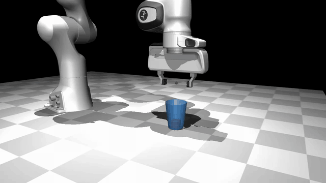
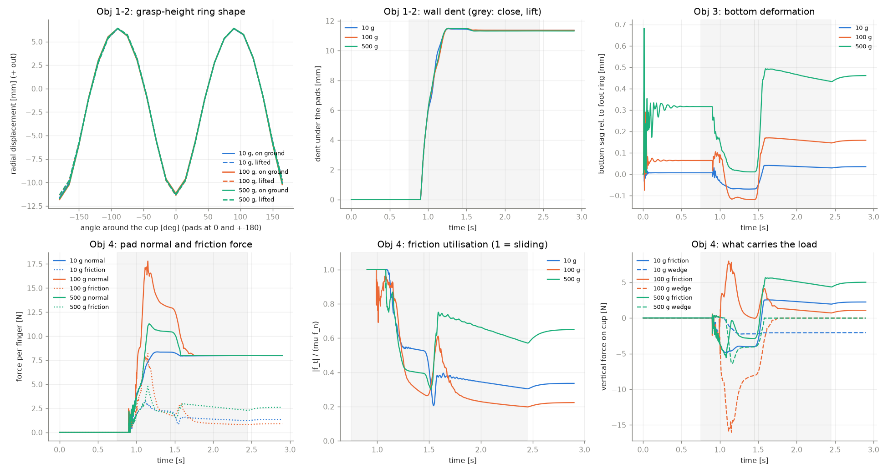

# Robot grasp of a deformable plastic cup in MuJoCo

A Franka Emika Panda picks up a thin plastic cup (0.5 mm polypropylene) with a cube inside
(10 g, 100 g, 500 g). The cup is deformable: the wall dents under the fingers, the bottom sags under
the cube, and friction holds the cup as it changes shape.

<p align="center"></p>

**Model.** The cup is a reduced-order discrete shell: rigid surface panels joined by spring-damper
joints, with bending stiffness from the shell bending rigidity D = Et³/12(1−ν²). Contact, friction and
integration are MuJoCo's. The model is checked step by step against beam, ring and plate theory
(`discrete_shell/01`–`04`) before the robot trials (`05`).

## Setup

```bash
python3 -m venv .venv && .venv/bin/pip install -r requirements.txt
./fetch_panda.sh                     # Panda model from MuJoCo Menagerie
```

## Run

```bash
cd discrete_shell
../.venv/bin/python 05_panda_cup_shell.py        # the 3 robot trials (~5 min, in parallel)
../.venv/bin/python 05_panda_cup_shell.py 0.5    # one trial, cube mass in kg
../.venv/bin/python 01_beam_gravity.py           # verification tests 01-04 (seconds to ~2 min each)
../.venv/bin/mjpython view.py panda 0.5          # live viewer (macOS: mjpython)
```

Outputs go to `discrete_shell/out/`. For each trial, `05` writes one video per objective:

| Objective | Video |
|---|---|
| 1. Wall deformation, cup on the ground | `panda_shell_<mass>_obj1_wall_grasp.mp4` |
| 2. Wall deformation during the lift | `panda_shell_<mass>_obj2_wall_lift.mp4` |
| 3. Bottom deformation | `panda_shell_<mass>_obj3_bottom_x10.mp4` (magnified 10×) |
| 4. Friction as the cup deforms | `panda_shell_<mass>_obj4_friction.mp4` (contact-force arrows) |

plus `panda_shell_<mass>_overview.mp4` and a summary figure `panda_shell.png`.

**All videos (3 trials × 5): [Google Drive](LINK)**

## Results (grip 8 N per finger)

| | 10 g | 100 g | 500 g |
|---|---|---|---|
| Cup lifted (target 150 mm) | 147.6 mm | 147.1 mm | 146.5 mm |
| Wall dent under the pads | 11.4 mm | 11.5 mm | 11.5 mm |
| Bottom sag, lifted | 0.03 mm | 0.16 mm | 0.46 mm |
| Friction used while holding | 33 % | 22 % | 64 % |
| Slip in the fingers | < 0.01 mm | < 0.01 mm | 0.03 mm |

<p align="center"></p>

`panda_cup_rigid.py` is the same pipeline with a rigid cup (the baseline).
