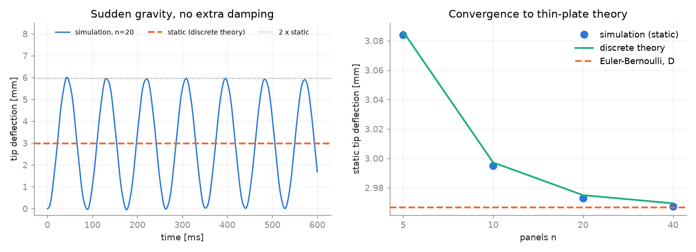
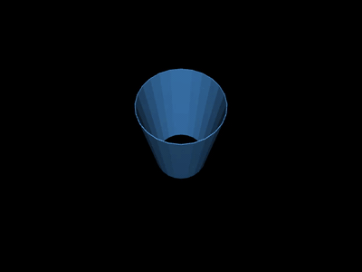
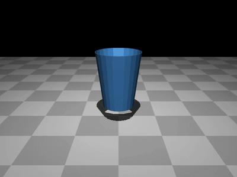
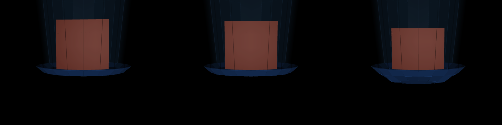
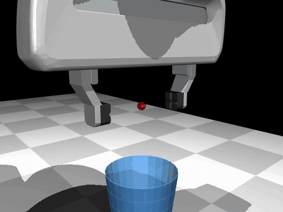
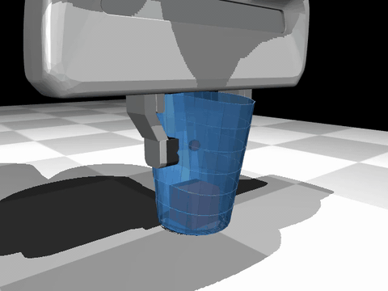
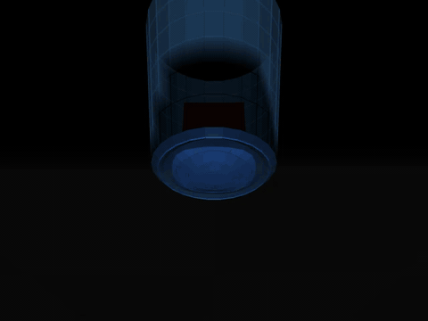
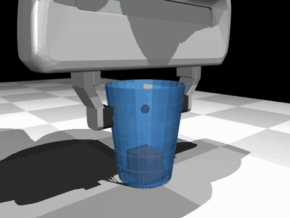

# Robot grasp of a deformable plastic cup in MuJoCo

A Franka Emika Panda picks up a thin-walled plastic cup with a cube inside (10 g, 100 g, 500 g),
simulated in MuJoCo. The cup is not rigid: its wall ovalises under the fingers, its bottom sags under
the cube, and the grip is held by friction on a surface that changes shape as it is squeezed.

  

## Approach

MuJoCo's built-in deformable models (2D and 3D flex) could not represent a stiff, thin, curved plastic
shell: at realistic polypropylene stiffness they became ill-conditioned, lost the curved rest shape,
or collapsed under gravity. So I built a **reduced-order discrete shell** on top of MuJoCo:

- The cup (72 mm rim, 90 mm tall, 0.5 mm polypropylene wall) is a set of rigid surface panels
  that define its curved undeformed shape: a conical wall, a rounded heel and a recessed bottom
  standing on a foot ring.
- Neighbouring panels are joined by spring-damper joints for bending, twisting and in-plane
  stretching. The bending stiffness is derived from the thin-shell bending rigidity
  D = Et³ / 12(1 − ν²) and then **verified against closed-form thin-shell results** before the cup
  ever meets the robot.
- Contact, friction and time integration are MuJoCo's own (soft-constraint contact, elliptic
  Coulomb cone), tuned so the very light panels do not sink into the heavier bodies that touch them.
- The Panda follows a hard-coded vertical pick: inverse kinematics for straight-line motion and a
  force-controlled gripper.

## Verification, step by step

The model was built up in stages, each checked against theory before moving on.

| Stage | Check | Result |
|---|---|---|
| Cantilever strip under gravity | Euler-Bernoulli with plate rigidity D | Tip deflection within 0.03 %; first frequency 11.37 vs 11.38 Hz |
| Cup wall floating in zero gravity | Rayleigh's ring ovalisation frequency | Within 0.15 %; rest shape exactly stress-free; energy never grows |
| Cup wall dropped on the floor | Free fall, energy balance | Lands at the free-fall time, recovers elastically, comes to rest upright |
| Full cup hung by its rim, cube inside | Clamped circular plate | Bottom within 5 % of plate theory |
| Robot pick, three cube masses | Force balance | Finger forces carry the cup + cube weight within 0.1 N |

  

  
  

  
   <em>Cup bottom under a 10 g, 100 g and 500 g cube (deformation magnified 20×).</em>

## Results: robot pick with 10 g, 100 g and 500 g cubes

Grip force 8 N per finger. All three cups are lifted 147 mm (of 150 mm) with the cube inside and
under 0.03 mm of slip in the fingers.

| | 10 g | 100 g | 500 g |
|---|---|---|---|
| Wall dent under the pads (on the ground → lifted) | 11.4 → 11.4 mm | 11.5 → 11.4 mm | 11.5 → 11.3 mm |
| Wall bulge at 90° to the pads | 6.4 mm | 6.4 mm | 6.4 mm |
| Bottom sag (on the ground → lifted) | 0.006 → 0.034 mm | 0.064 → 0.157 mm | 0.316 → 0.458 mm |
| Friction used while holding (share of μ·N) | 33 % | 22 % | 64 % |
| Slip in the fingers while holding | 0.007 mm | 0.004 mm | 0.026 mm |

### Wall deformation while squeezed on the ground, and during the lift

  
  

The grip ovalises the wall into a clean two-lobed shape: 11.4 mm inward under each pad and 6.4 mm
outward at 90°. The dent barely changes during the lift; the wall under the pads carries the load in
shear.

### Bottom deformation

  
   <em>Seen from below, bottom deformation magnified 10× (wall at true scale).</em>

On the ground the cube bends the recessed bottom over the foot ring. Once lifted, the bottom hangs
from the wall instead of resting on the floor, and sags more (0.46 mm for 500 g).

### Friction as the cup deforms

  
   <em>Contact forces drawn as arrows.</em>

- While the fingers close, the wall slides along the pads (friction saturated); once the dent has
  formed, the contact sticks.
- The dent tilts the wall under each pad so that the pad's normal force points slightly **down**.
  A rigid tapered cup is wedged upward by the grip; the deformed cup is not, so friction carries the
  whole load, and for the lightest cube it also carries the downward push locked in during the close.
- With 500 g the grip uses 64 % of the available friction, so the minimum grip force is about
  5 N per finger at μ = 0.5.

  

## Tools

MuJoCo 3.14 (Python bindings), Franka Emika Panda model from MuJoCo Menagerie, NumPy, Numba,
Matplotlib. Everything runs on a CPU; one robot trial takes about 5 minutes on an Apple M3 Pro.

## Limitations

- The dent under an 8 N grip is deep in the large-deformation regime and has not been compared with
  a physical pinch test.
- The panel mesh is coarse (24 panels around the cup), so dents are resolved at about 7 mm.
- Material damping at low frequency is not yet calibrated.

The source code is not public. Contact me if you would like to discuss the method.
